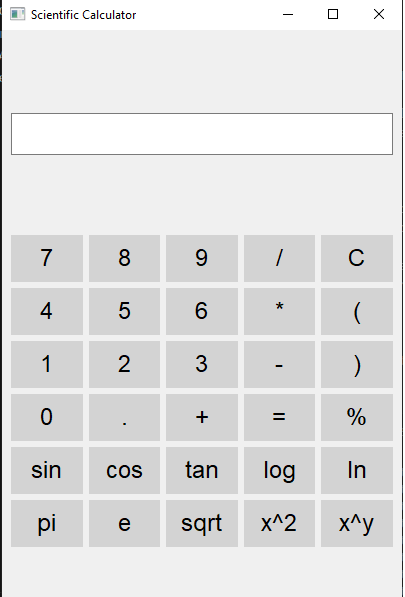

# Scientific Calculator

A powerful and visually attractive scientific calculator built using `PyQt5`. This calculator includes basic arithmetic operations as well as advanced scientific functions.

## Features

- Basic arithmetic operations: addition, subtraction, multiplication, division, and modulus.
- Advanced scientific functions: sine, cosine, tangent, logarithm, natural logarithm, square root, square, and exponentiation.
- Constants: π (pi) and e (Euler's number).
- Responsive and user-friendly graphical interface.

## Screenshots



## Installation

### Prerequisites

- Python 3.x
- `PyQt5` library

### Installing `PyQt5`

You can install `PyQt5` using `pip`:

```sh
pip install PyQt5
```

## Usage

1. Clone the repository:

```sh
git clone https://github.com/your-username/scientific-calculator.git
cd scientific-calculator
```

2. Run the calculator:

```sh
python scientific_calculator.py
```

## Code Explanation

The main code for the calculator is contained in the `scientific_calculator.py` file.

### Main Components

- **Imports**: Import necessary modules from `PyQt5` and `math`.
- **Class `ScientificCalculator`**: This class sets up the main window and the calculator functionalities.
  - **Initialization**: Sets up the main window and the layout.
  - **Button Setup**: Creates buttons and arranges them in a grid layout.
  - **`on_button_click` Method**: Handles what happens when a button is clicked.
  - **`handle_advanced_functions` Method**: Handles scientific functions such as `sin`, `cos`, `log`, etc.
  - **`calculate` Method**: Evaluates the expression and updates the input field.

## Contributing

Contributions are welcome! Please open an issue or submit a pull request for any features, bug fixes, or enhancements.

### Steps to Contribute

1. Fork the repository.
2. Create a new branch (`git checkout -b feature-branch`).
3. Make your changes.
4. Commit your changes (`git commit -m 'Add some feature'`).
5. Push to the branch (`git push origin feature-branch`).
6. Open a pull request.

## Acknowledgements

- Thanks to the PyQt5 developers for creating a powerful and flexible GUI framework.
- Inspiration and code snippets from various online resources and tutorials.

